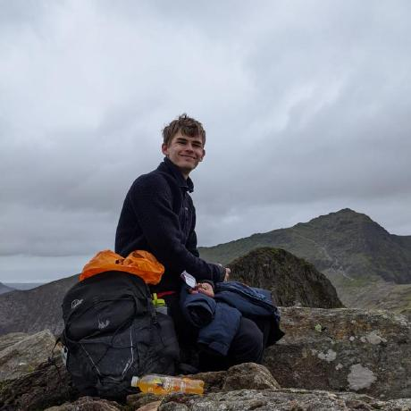

## About Me

Hi! I am a third year PhD student in the Department of Meteorology at the University of Reading. My project looks into the potential applications of decadal predictions for the energy sector. I also work part-time as a Science Engagement Fellow for the Royal Meteorological Society, where we bring together professionals, policymakers, and academics to discuss the challenges facing the energy sector.

<!-- This is a jekyll based resume template. You can find the full source code on [GitHub](https://github.com/bk2dcradle/researcher) -->
<!-- 
{:height="36px" width="36px"}

{:height="36px" width="36px"} -->

---

## Timeline

Year | Institution | Activity
-----|-------|--------
current | University of Reading  | PhD, Decadal Predictions for the Energy Sector
current | Royal Meteorological Society | Science Engagement Fellow ([Energy](https://www.rmets.org/special-interest-groups/energy))
2022 | Lancaster University | Masters Degree, Natural Sciences
2021 | Yordas Group | Independent Consultant, Sustainability
2021 | Oregon State University | Natural Sciences (Study Abroad)

---

## More information

* [Research](https://benhutchmet.github.io/researcher_BWH/research): PhD Project, publications, teaching and other activities.
* [Conferences](https://benhutchmet.github.io/researcher_BWH/conferences): Information about past and upcoming conferences.
* [Blog](https://benhutchmet.github.io/researcher_BWH/blog): Writing about energy-meteorology and beyond.
* [CV](https://benhutchmet.github.io/researcher_BWH/BWH_cv_220324.pdf): Up-to-date CV.
* [Contact](https://benhutchmet.github.io/researcher_BWH/contact): Contact information and other relevant pages.

## Acknowledgements

*Page design based on template by [Ankit Sultana](https://github.com/ankitsultana)*
